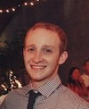

========
 People
========

.. image:: mugs/labphoto2015.JPG
   :width: 60%

Faculty
=======

	|bill| William Jagust

	`The Boss <http://en.wikipedia.org/wiki/Bruce_Springsteen>`_
	and Our Benevolent Dictator

Fellows
=========

    |berry| Anne Berry

    My research focuses on understanding why cognitive flexibility, the ability to dynamically respond to new task demands, declines with age. I am examining factors such as decreases in brain volume, dysregulation of the neurotransmitter dopamine, and changes in brain network activity.
 
    I completed my PhD at the University of Michigan where I worked with Drs. Cindy Lustig and Martin Sarter. Broadly, my doctoral research investigated the contribution of the neurotransmitter acetylcholine to the control of attention.

++++

    |tess| Tess Kornfield

    `Google Scholar <https://scholar.google.com/citations?user=geD3N1IAAAAJ&hl=en>`_

    I completed my PhD in neuroscience at the University of Minnesota in the lab of Eric Newman, where I studied blood flow regulation in the rat retinal vascular network. My research in the Jagust lab focuses on understanding how aging-related changes in memory and cognition are associated with brain amyloid deposition, as measured with PET. 

++++

    |fsam| Samuel Lockhart

    `Google Scholar <https://scholar.google.com/citations?user=lbKAf4cAAAAJ&hl=en&oi=ao>`_

    My research project in the Jagust lab examines neuroimaging biomarkers of preclinical Alzheimer’s Disease (AD). Preclinical progression along the AD pathological cascade may be inadvertently conflated with the normal aging process in many studies seeking to understand the causes of gradual cognitive decline late in life. Therefore, our goal is to investigate effects of tau and Aβ accumulation (measured using PET) on structural connectivity between these regions (measured using MRI and DTI), and the relative effects of these brain differences on memory performance.
    
    I earned my PhD from UC Davis in 2014, working with Dr. Charles DeCarli to investigate the contributions of age and CVD-related white matter injury (white matter hyperintensities or WMH) to attentional control network function and cognitive performance.

++++

    |hwamee| Hwamee Oh

    hwameeoh at berkeley dot edu

    My research in the Jagust lab examines cognitive, structural, and
    functional alterations in relation to normal aging and pathological 
    aging involving beta-amyloid deposition using multimodality imaging 
    techniques of PIB-PET, FDG-PET, structural MRI, and fMRI and 
    neuropsychological tests.

    Prior to the Jagust lab, I received my PhD from SUNY-Stony Brook in 
    2009,where I worked with Hoi-Chung Leung. My doctoral research 
    focused on the behavioral and neural bases of working memory, 
    specifically, executive processes and an interaction of visual and 
    verbal representations in healthy young adults.

    **Papers**

    [Oh2013_2]_ Frontotemporal Network Connectivity during Memory Encoding Is Increased with Aging and Disrupted by
    Beta-Amyloid.
    *Oh H, Jagust WJ.*
    **J Neurosci. 2013 Nov 20**
    `pubmed <http://www.ncbi.nlm.nih.gov/pubmed/24259567>`_

    [Oh2013]_ Association of gray matter atrophy with age, b-amyloid, 
    and cognition in aging
    *Oh H, Madison C, Villeneuve S, Markley C, Jagust WJ.*
    **Cereb Cortex. 2013 Feb 6.**
    `pubmed <http://www.ncbi.nlm.nih.gov/pmc/articles/PMC3038633/>`_

    
    [Oh2012_2]_ Covarying alterations in Aβ deposition, glucose 
    metabolism, and gray matter volume in cognitively normal elderly
    *Oh H, Habeck C, Madison C, Jagust W*
    **Human Brain Mapping, epub  Sep 11, 2012**
    `Human Brain Mapping Link <http://onlinelibrary.wiley.com/doi/
    10.1002/hbm.22173/abstract>`_

    [Oh2012]_
    Effects of age and β-amyloid on cognitive changes in normal elderly people (2012) *Hwamee Oh, Cindee Madison, Thaddeus J. Haight, Candace Markley, William J. Jagust*
    **Neurobiology of Aging 2012**
    `science direct <http://www.sciencedirect.com/science/article/pii/S0197458012001534>`_

    [Oh2010]_
    Beta-Amyloid affects frontal and posterior brain networks in 
    normal aging. (2010) *Oh H, Mormino EC, Madison C, Hayenga A, Smiljic A, Jagust WJ.*
    **Neuroimage. 2010 Oct 18**
    `pubmed <http://www.ncbi.nlm.nih.gov/pubmed/20965254>`_	

++++

    |rik1| Rik Ossenkoppele

    `Google Scholar <https://scholar.google.com/citations?user=_7MvrN4AAAAJ&hl=en&oi=ao>`_

    Rik completed his PhD under Bart van Berkel at the VUMC in Amsterdam.  He currently splits his time and talent between San Fransicso and Amsterdam, using various neuroimaging modalities to better understand neurodegenerative diseases associated with aging.  He is an avid fan of the AFC Ajax, a burgeoning `movie star <https://www.youtube.com/watch?v=OVZQHv-7I8U>`_, and an expert in men's fashion.  

++++

    |scholl| Michael Schöll

    michael dot scholl at berkeley dot edu

    `Google Scholar <http://scholar.google.com/citations?user=hEHgZxMAAAAJ&hl=de>`_

    Michael swapped Swedish Västkust with American West Coast to finally see some light on the imaging horizon. Whenever he is not trying to convince people that PET is not an animal, he tries to get his hands on anything musical.

++++

    |steffi| Stefanie Schreiber

    At the Otto-von-Guericke University, Magdeburg, Germany (head: Prof. Hans-Jochen Heinze) I am working as neurologist, received my PhD in 2007 and finished my habilitation in 2014. During my habilitation I investigated the natural course of cerebral small vessel disease and its interplay with beta-amyloid-pathology in a hypertensive rat model. I came to the Jagust lab to learn biomarker PET and multimodal imaging techniques. My research in the lab will potentially focus on the interplay between biomarkers of neurodegeneration and of cerebral small vessel disease in the non-demented elderly.

    **Papers**

    Schreiber et al. Sonography of the median nerve in CMT1A, CMT2A, CMTX and HNPP. Muscle Nerve. 
    2013 Mar;47(3):385-95. http://www.ncbi.nlm.nih.gov/pubmed/23381770

    Schreiber et al. The pathologic cascade of cerebrovascular lesions in SHRSP: is erythrocyte accumulation an early phase? J Cereb Blood Flow Metab. 2012 Feb;32(2):278-90.  http://www.ncbi.nlm.nih.gov/pubmed/21878945

Visiting Scholars
=================

	|gil| Gil Rabinovici

	Regularly visits from UCSF, Stanford Alum, `Cubs <http://chicago.cubs.mlb.com/index.jsp?c_id=chc>`_ fan!

	**Papers**

	[Rabinovici2011]_ Amyloid versus FDG-PET in the differential diagnosis of AD and FTLD

	[Rabinovici2010]_  Increased metabolic vulnerability in 
	early-onset Alzheimer's disease is not related to amyloid burden

	[Rabinovici2008]_ AB amyloid and glucose metabolism in 
	three variants of primary progressive aphasia

++++
	

Graduate Students
=================

    |begany| Katelyn Arnemann (Begany)

    I'm a PhD candidate in the Neuroscience Program at UC Berkeley.
    Employing multimodal brain imaging of age-/disease-related perturbations, 
    my research aims to uncover (ideally fundamental) links between brain 
    networks, cognition, and pathology.

++++

    |shawn2| Shawn Marks

    shawn dot marks2 at gmail dot com

    Back for another round of research, stay tuned for exciting findings.

++++

    |dean| Alex Dean

    Alex is a masters student in Epidemiology and Biostatistics investigating brain function using a combination of genetic and imaging methods.

Staff
=====

    |nagehan| Nagehan Ayakta

    I recently graduated from Cal after doing my honors thesis in the Jagust Lab on the pattern of beta-amyloid deposition. Now after an exciting summer traveling in Europe, I am back in the lab working with Gil Rabinovici on processing exciting PET data, including PIB, FDG, and tau. Outside of work, I love to cook, travel, and read.

++++	

	|suzanne| Suzanne Baker

	Suzanne swims with the sharks and will devour wimpy little men
	all while juggling MRI and PET scanners!

++++    

    |bell| Rachel Bell

    Rachel graduated from Boston University with a B.A. in Neuroscience.  A week later, she moved to the West Coast to become the new Jagust Lab manager! In her free time she loves hiking, camping, rock climbing, cooking, and wandering around book stores.

++++

    |horng| Andy Horng

    I studied Cognitive Science and EECS at Cal, ran off to the tech industry for a few years, then happily returned to assist in PET analysis. I like to swim, jam sesh, build forecasting models, and loudly discuss basketball.

++++

    |faria| Jamie Faria

    Jamie is a recent graduate from the newest UC campus, Merced, with a B.S. in Cognitive Science. She is now assisting in PET processing and is particularly interested in eventually continuing her education in brain sciences research. She loves animals, especially her family’s two Swedish Vallhunds, Fox and Goose, and ferocious cat, Darwin. When away from the lab she can be found watching sports, cooking yummy meals, and enjoying the outdoors.

++++

    |susan| Susan Landau
    
    Assistant Research Scientist

    `Research and Background <http://smlandau.org>`_

    slandau at berkeley dot edu

    **Papers**
    
    [Landau2015]_Measurement of longitudinal Aβ change with 18F florbetapir PET and standard uptake value ratios

    [Landau2014]_ Amyloid PET imaging in Alzheimer’s disease: a comparison of three radiotracers

    [Landau2013]_ Comparing Positron Emission Tomography Imaging and Cerebrospinal Fluid Measurements of b-Amyloid

    [Landau2012]_ Lifetime cognitive engagement is associated with low beta-amyloid deposition

    [Landau2012_2]_ Amyloid deposition, hypometabolism, and longitudinal cognitive decline

    [Landau2012_3]_ Amyloid-b Imaging with Pittsburgh Compound B and Florbetapir: Comparing Radiotracers and Quantification Methods

    [Landau2010]_ Comparing predictors of conversion and decline in mild cognitive impairment

    [Landau2009_2]_ Associations between cognitive, functional, 
    and FDG-PET measures of decline in AD and MC

++++

    |andreas| Andreas Lazaris

    Andreas is a recent graduate of UC Berkeley with a degree in Cognitive Science, having completed his honors thesis in the Jagust Lab. After working as an undergraduate in the Jagust Lab for 3 years, Andreas has joined Gil's team at the UCSF Memory and Aging Center as a Clinical Research Coordinator, working primarily with PET imaging. Outside of the world of neurology, you can catch Andreas riding his bike from cafe to cafe throughout the East Bay and hitting a local live show whenever possible.

++++

    |taylor| Taylor Mellinger

    I recently graduated from UC Davis with a B.S. in Neurobiology, Physiology, and Behavior. I'm excited to be here to help out with neuropsychological testing and neuroimaging. When not in the lab, I enjoy traveling, hiking, exploring the city,​​ and spending time with my friends and family.    

++++

    |kris| Kristin Norton

    Kris is a radiologist specialist working to collect PET data.

++++

    |daniel| Daniel Schonhaut

    I studied psychology at UCLA and am here to learn fMRI data analysis and 
    anything else I can pick up along the way. Other things I am working on right 
    now include winning my fantasy soccer league without putting Luis Suarez on my 
    team, trying every kind of coffee from Philz, and guessing what the next season 
    of American Horror Story will be about.

++++    

    |vyoma| Vyoma Shah

    As an undergrad here at Cal, I loved the interdisciplinary nature of Cognitive Science. I am fascinated by the intricacies and complexities of a ~3 pound piece of flesh we call the brain. I aim to better understand how it works, and apply these understandings to come up with meaningful innovations in the field of public health. Outside of the lab, you're likely to find me playing Scrabble or Chess, enjoying chai tea, chocolate or cheese, traveling, or just exploring new places in the city with friends.

++++

    |swinnerton| Kaitlin Swinnerton

    I recently graduated from UCLA with a B.S. in Cognitive Science and a minor in Society and Genetics. When not in lab, I can be found either chasing after a frisbee or watching other people chase after a football (or basketball, or baseball, or soccer ball). Life goals include winning a USA Ultimate national championship and setting more life goals.

++++

Undergraduate Assistants
========================

    |sasha| Sasha Ashall

    After yee-hawing my way from Missouri to the wild west coast, I'm here to stay. I'm a first year Cal undergrad planning to major in Cognitive Science with an emphasis in Neuroscience. When I'm not furiously doing homework, I'm trying new restaurants around town and watching Friday Night Lights.

++++

    |dino| Dino Digma

    I am a third year student at UC Berkeley. I aspire to do clinical research in the future.

++++
    
    |april| April Kiyomi Hishinuma

    April is majoring in cognitive science with an emphasis in neuroscience. Her love for the brain has lead her to pursue an occupation in both research and health care. She aspires to learn as much as she can about the brain before attending medical school. When not found studying, she will usually be spotted working out at the gym, singing with her guitar, or eating with friends.   

++++

    |Sharada| Sharada Narayan

    I'm a junior studying Public Health and English, but I'm eager to learn about anything and everything. I'm particularly interested in exploring how computational methods can be used to better understand the brain and the progression of aging. In my free time, I enjoy reading, writing, and giggling at lame puns (the real reason I enjoy Shakespeare so much).

++++

    |stacey| Stacey Jou

    Stacey is a third year majoring in Molecular and Cell Biology with an emphasis in Neurobiology. She is particularly interested in clinical studies of the brain and hopes to attend medical school in the future. Stacey also enjoys spending her time sketching still-life and throwing around a frisbee.

++++

    |matta| George Matta

    George is a third year Public Health major, interested in mental and neurological health. He is more than certain that he will eventually be resurrected as a zombie--he just loves brains that much.    

++++

    |peng| Ollie Peng

    Hi! I'm a Junior double majoring in bioengineering and electrical engineering and computer science. I'm fascinated by the possibility in the future that humans will be able to control robotic limbs and prosthesis with their minds, and as a result I love learning how the brain works.  I also love cooking jambalaya, impressing myself on the piano, and lifting heavy things in the gym and putting them back down.

++++

    |schuyler| Schuyler Stoller

    I am an undergrad here at UC Berkeley intending to major in MCB with a Neurobiology emphasis. I plan on pursuing a career in research and/or medicine, depending on how I fare for the next couple of years.

++++

    |gautam| Gautam Tammewar

    I'm a senior at UC Berkeley with a major in Molecular and Cell Biology with a Neurobiology emphasis. I am currently working on a senior thesis regarding the differences between the variants of Alzheimer's Disease. When not in lab, I am often keeping up with the latest basketball and soccer news, listening to music and learning to play a song on the piano, or playing FIFA. In the future, I hope to attend medical school and continue research as a clinical neuropsychologist.

++++

    |kwang| Kevin Wang

    I am a currently a 2nd year here at UC Berkeley from New Jersey. Outside of the lab, you can find me at the library, gym, or the pool. I enjoy eating all kinds of foods, watching movies, and attending concerts. Other than that, I spend my days struggling to learn how to cook and speak a third language.

Alumni
======

    |henry| Henry Schwimmer

    henry dot schwimmer at gmail dot com

    When not in the lab, he can be found shredding the gnar in Tahoe or 
    hiking the backcountry with his harmonica. 
    Henry is on his way to start med school at Emory! As a long-time staple in the Jagust Lab, he will leave a big hole in our hearts.

++++

   |jacob| Jacob Vogel

    Graduated from Hampshire College with a degree in Neuroscience.  Interests include Neuroimaging, Statistics, Clinical Neuro, and Neuroendocrinology. Jake is off to pursue is PhD at McGill!

++++

    |elman| Jeremy Elman

    `Google Scholar <http://scholar.google.com/citations?user=YZ-VP40AAAAJ&hl=en>`_

    I received my PhD from UC Berkeley in 2012 under `Arthur Shimamura <http://ist-socrates.berkeley.edu/~shimlab/>`_. My doctoral research investigated contributions of the posterior parietal cortex to episodic memory using fMRI. As part of the Jagust lab, my research focuses on alterations in cognitive performance and multi-modal imaging biomarkers as a function of beta-amyloid deposition employing techniques that include structural MRI, task-based and resting-state fMRI, and PIB-PET.

++++

    |allie| Allie Fero

    Allie graduated from Berkeley with a degree in physics and joined the to help with PET scan image analysis.  She left us
    for a brief stint in the industry world and will likely be pursuing a graduate degree in Environmental Engineering at MIT or UCSD (we don't know yet) this fall!  Go Allie!!

++++

    |annez| Anne Zeng

++++
    
    |ghassan| Ghassan Makhoul

++++

    |sylvia| Sylvia Villeneuve

    villeneuve dot sylvia at gmail dot com

    Https://sites.google.com/site/villeneuvesylvia/

    Sylvia is currently completing a postdoc at Northwestern, and has
    recently been accepted for a tenure-track position at McGill!! We
    will miss her energy and enthusiasm, but we're happy she's finally
    going home!

    Sylvia completed a Ph.D. in Neuropsychology at University of Montreal in 
    2011, with Dr. Sylvie Belleville. Her doctoral work focused on the 
    impact of vascular diseases on the cognitive profile of persons with 
    mild cognitive impairment. 

    Her main goal in the Jagust lab was to learn 
    PIB-PET and FDG-PET imaging techniques. Her research examined the 
    interaction between beta-amyloid deposition, glucose metabolism, 
    vascular diseases and genetic factors, and their impact on 
    neuropsychological measures and cognitive status.

    **Papers**

    Villeneuve et al., Vascular risk and Aβ interact to reduce cortical thickness in AD vulnerable brain regions. Neurology. 2014;83:40-47 
    http://www.ncbi.nlm.nih.gov/pubmed/24907234

    Villeneuve et al. Cortical thickness mediates the effect of β-amyloid on episodic memory. Neurology. 2014;82:761-767 
    http://www.ncbi.nlm.nih.gov/pubmed/24489134

++++

    |pia| Pia Ghosh

    Pia was an instrumental member in helping to build Gil's lab
    and was an organizing master--so much so that we needed
    TWO people to replacer her!! She is now gracing our nation's 
    capital pursuing an MA in Physiology at Georgetown. 

++++

     Angie Yi

++++

    Renaud La Joie

    `Research Gate <https://www.researchgate.net/profile/Renaud_La_Joie>`_

    `Google Scholar <http://scholar.google.fr/citations?user=zQ2VLFkAAAAJ>`_

    Renaud joined our lab after pursuing a PhD with `Gaël Chételat
    <http://gael-chetelat.fr/>`_ which was the beginning of what we hope is 
    a long term collaboration.

    He has since betrayed us to go back to France to waste his time in 
    med school in Lyon.  His incredible wealth of information, collaborative
    spirit, and dashing good looks will be sorely missed in the Jagust Lab.

    **Publications**

    `Region-specific hierarchy between atrophy, hypometabolism, and β-amyloid (Aβ) load in Alzheimer's disease dementia.
    <http://www.ncbi.nlm.nih.gov/pubmed/23152610>`_

    `Differential effect of age on hippocampal subfields assessed using a new high-resolution 3T MR sequence.
    <http://www.ncbi.nlm.nih.gov/pubmed/20600996>`_

++++

    Sam Crowley

    Sam is on his way to pursue a PhD in Clinical Pysch at Florida State
    University.  Later gator!

++++

    Monika Varga Doležalová

    Monika has returned to her hospital in Slovakia.  She leaves behind
    some excellent research on subjective memory complaint, and a lab full
    of admirers.  

++++

    Brendan Cohn-Sheehy

    Brendan is on his way to UC-Davis's medical school to pursue an MD-PhD program, 
    which he hopes will train him to become one of the world's great Neurologists.

    **Posters**

    `AAIC 2013 talk (pdf) <_static/posters/brendan_aaic2013_talk.pdf>`_

    `AAIC 2013 poster (pdf) <_static/posters/brendan_aaic2013_poster.pdf>`_

++++
  
    Samia K. Arthur-Bentil

    Samia pioneered the reconstruction of the lab's PET scan data and 
    came to the lab to explore the mystery of neurodegenerative disease 
    via command line interfaces. She is now attending Brown University's
    medical school, and is surely impressing everybody as always.

++++

    Helaine St. Amant

    Helaine graduated with a degree in Molecular and Cell Biology with an 
    emphasis in Neurobiology.  She has now embarked on the long road to
    becoming a fantastic medical doctor.

++++

    Cindee Madison 

    Cindee has moved on the magical world of industry where she is currently
    working on a secret project that will inevitably blow your mind.  Her 
    invaluable programming expertise and deep kindness will always be 
    rememberd as an indelible feature of the Jagust Lab!     

    She codes and loves `Python <http://www.python.org/>`_ 
    
    Enjoys `vim <http://www.vim.org/>`_ 
    
    Want to learn python??
    `IPython <http://ipython.org/install.html>`_, and very useful `ipython notebooks <http://nbviewer.ipython.org/>`_
    
    my blog `rationalgirl.com <http://www.rationalgirl.com/blog/html/index.html>`_

++++

    Miranka Wirth
    
    `Personal Website <https://sites.google.com/site/mirankawirth>`_
    
    Miranka was a postdoctoral fellow at the Jagust Lab.  She is now in Germany
    and is soon to make a research lab very, very lucky to have her!   

    **Posters**

    `AAIC 2013 poster (pdf) <_static/posters/wirth_aaic2013.pdf>`_

++++

    Jessica Dai

++++

    Tanu Patel

++++

    Scott Roberts

    Scott Roberts, PhD came to the Jagust Lab from the University of Michigan
    School of Public Health, where he is Associate Professor of Health Behavior
    and Health Education. Dr. Roberts' research addresses ethical and
    psychosocial issues involved in disclosing genetic risk information for
    adult-onset conditions, with Alzheimer's disease as a primary focus. He is
    Co-PI of the longstanding REVEAL (Risk Evaluation and Education for
    Alzheimer's Disease) Study, a NIH-funded series of randomized clinical
    trials examining the psychological and behavioral impact of APOE genotyping
    on first-degree relatives of people with AD. He also serves on ethics
    advisory boards for forthcoming large-scale AD prevention trials including
    the A4 Study and Alzheimer's Prevention Initiative.

++++

    Andrea Long

    Andrea has been called back to a position in a top secret lab who 
    existence is still denied. 
    She is assisting in the lab part-time, 
    but only if we don't ask her about the **secret lab**.

++++

    Sam Greene

++++

    Tad Haight

    Tad has moved on to a post-doc at the NIH on the other side of the states.
    Everyone will miss his insight on statistical analysis.

    **Papers**

    Relative contributions of biomarkers in Alzheimer’s Disease. 
    *Haight, TJ, Jagust, WJ.*
    **Annals of Epidemiology (2012)22:868-875**

    Dissociable effects of Alzheimer’s Disease and White Matter 
    Hyperintensities on Brain Metabolism. 
    *Haight, T, Landau,S, Carmichael, O,Schwarz, C, DeCarli, C, Jagust, W.*  
    **JAMA Neurology (2013) 70(8): 1039-1045**
    

++++

    Manja Lehmann

    Manja was a visiting research scholar from London (UK) who joined 
    the Memory and Aging Center at UCSF in October 2011. 
    She continues her postdoctoral work at the Dementia Research Center 
    at University College London:
    http://www.ucl.ac.uk/drc. 
    
    Her research aims to investigate functional connectivity 
    networks in the brain, in particular in patients with different 
    variants of Alzheimer’s disease, including Posterior Cortical Atrophy
    (visual variant), Logopenic Progressive Aphasia (language variant), 
    and typical Alzheimer’s disease (amnestic variant).

    **Papers**

    [Lehmann2013]_ Diverging patterns of amyloid deposition and 
    hypometabolism in clinical variants of probable
    Alzheimer’s disease
    *Lehmann M, Ghosh PM, Madison C, Laforce R, Corbetta-Rastelli C, 
    Weiner MW, Greicius MD, Seeley WW, Gorno-Tempini
    ML, Rosen HJ, Miller BL, Jagust WJ, Rabinovici GD*
    **Brain. 2013 Mar;136(Pt 3):844-58**

++++

	Caleb Wang

++++

    Grace Tang

    Grace presented a wonderful paper for her Honors thesis.

    **Cognitive Phenotypes and AD Biomarkers in Healthy Adults**
    `CSSA Poster (pdf) <_static/posters/GraceCSSAposter.pdf>`_
    
    `Honors Thesis (pdf) <_static/posters/HonorsThesis_GraceTang.pdf>`_

    Grace is continuing to impress while studying Cell Biology in Graduate School
    at ETH in Switzerland. She is planning to focus her research on neuropathies.

++++

        Tricia Ngoon

        Tricia graduated, and is now working as a Research Assistant 
        at the Stanford Cognitive and Systems Neuroscience
        Laboratory to examine the development and improvement 
        of math abilities in children.

++++

        Hyesoo Youn

        Hyesoo rotated through our lab from MCB, and investigated the deposition 
        pattern of Beta Amyloid in a cognitively normal old cohort. 

++++

        Elizabeth Counterman

	Elizabeth rotated in the lab looking at the relationship between Beta Amyloid and three intrinsically connected networks (Default Mode, Dorsal Attention, Frontal Parietal Control Network ). 

++++

	Linh Cat Dang

	Linh has moved to a post-doc at Vanderbilt University where she will
	continue with her work on Dopamine

++++

	Rik Ossenkoppele

	Rik has returned to VU University medical center in Amsterdam (Alzheimer center and department of Nuclear Medicine & PET Research) after a very productive 6 months of research and teaching the Americans how to play a proper game of soccer. He will be sorely missed.

        **Presentations**

        *Award Winning Talk*

        Increased Parietal Amyloid Burden and Metabolic Dysfunction in 
        Alzheimer's Disease with Early Onset
        `SNM2012 (pdf) <_static/posters/rik_SNM2012.pdf>`_

	**Papers**

	Amyloid burden and metabolic function in early-onset Alzheimer's 
	disease: parietal lobe involvement (2012) Ossenkoppele R et al.
	Brain. 2012 Jul :2115-25 `pubmed <http://www.ncbi.nlm.nih.gov/pubmed/22556189>`_

	Longitudinal imaging of Alzheimer pathology using [11C]PIB, 
	[18F]FDDNP and [18F]FDG PET. Ossenkoppele R et al. 
	Eur J Nucl Med Mol Imaging. 2012 Jun;39(6):990-1000.
	`pubmed <http://www.ncbi.nlm.nih.gov/pubmed/22441582>`_

++++

	Candace Markley

        Candace has left us for warmer temps, and there is still a secret list for people who want her to
        be their doctor once she finishes up at Emory Medical School....its a long list

++++

	Aneesh Donde

	Aneesh has come under the influence of the *Jagust* love of research and decided against Medical School.
        You can now find him pursuing a PhD at Johns Hopkins.

++++

	Raymond Lo

        Has finished his PhD with great style, and returned to research closer to his wife and son. 
        Still holds the lab record for most quickly accepted manuscript (less than 24 hours)

++++

	 Roxana Dhada

++++

	Tiffany Truong

	**Student Presentation**

	`Dopamine-mediated networks <_static/posters/truong_dopamine.pdf>`_

++++

	Michael Brandel

	Graduated and working in a UCSF schizophrenia lab.

++++

	Chiara Martina Corbetta-Rastelli

++++

        Jiann Mok

	Moved on to exploring user-interfaces

++++

	Natalie Marchant

	We are proud to report that Natalie is now Lecturer (Assistant Professor) in Old Age Psychiatry at The Institute of Psychiatry, King's College London   https://kclpure.kcl.ac.uk/portal/natalie.marchant.html  
    

	**Papers**

	[Marchant2011]_	Cerebrovascular disease, beta-amyloid and cognition in aging.

	Marchant, N.L., King, S.L., Tabet, N., & Rusted, J.M. (2010).
	Positive effects of cholinergic stimulation favor young APOE epsilon4 carriers. Neuropsychopharmacology. 2010 Apr;35(5) `pubmed <http://www.ncbi.nlm.nih.gov/pubmed/20072115>`_

	
	**Presentations and Posters**

	`Imaging Amyloid and Cerebrovascular Disease in Aging (Featured
	Research presentation at the Alzheimer's Association International
	Conference. Paris, France, 2011) <_static/posters/PDF_Marchant_ICAD_2011.pdf>`_

	`Contribution of Vascular Brain Injury and Brain Aβ to Cognitive Function. (Human Amyloid Imaging 2012.) <_static/posters/Marchant_HAI_2012.pdf'>`_

	`Vascular Disease and Amyloid Imaging in Cognitive Aging (SFN 2010 .pdf) <_static/posters/marchant_sfn2010.pdf>`_

++++

        Benedicte Rossi

	Benedicte has her hands full with Carmen, and exciting new aspects of science to explore.

++++

        Courtney Gallen

	Courtney is a first year graduate student in the Helen Wills Neuroscience Institute. Her project while rotating in the Jagust Lab investigated FDG hypometabolism associated with fMRI task activation in a Healthy Elderly Cohort with Amyloid burden. 

++++

        Elizabeth Mormino

	http://ecmormino.com/

++++

	Robert Laforce

	Has returned to Canada, but left us so much a wiser.

	`Multivariate data analysis of FDG-PET and PIB-PET in three conditions with underlying Alzheimer's pathology (HAI 2012 jpg) <_static/posters/RLaforce_HAI2012.jpg>`_
	

++++

	Neha Agarwal

++++

	Scott Wilson

++++

	Adi Alkalay

	Adi is returning to the homeland to complete her medical residency, as soon as she finishes her third genetic research project.  She will be missed.

++++

	Irene Yen

	Has left the Academic world to explore the exciting fast-paced world of start-ups, working with educational software.

++++

	George Zhang 

	Worked with Suzanne on PIB, but has left to loftier pursuits
++++

	Amynta Hygenga

	Amynta has left us for Graduate School to pursue a career in Clinical Psychology, though she already 
	proved her skills by handling the behavioral disorders of the researchers in our lab.

++++

	Luca Dellavedova

	Returned to the University of Milan where he is a resident in  Nuclear Medicine 

++++

	Martina Studer
	
	Returned to Switzerland to finish her PhD.

++++

	Ellen Klostermann Wallace

	Ellen recently left the cool warmth of Berkeley for the balmy snow of
	Chicago, she is deeply missed. Here is a recent presentation she had.

	`Caudate Dopamine Release is Correlated with Frontal Lobe fMRI Activity and Performance During a Two-Back Working Memory Task (SFN 2010 .pdf) <_static/posters/eckw_sfn2010.pdf>`_
	
++++

	Matar Davis

	Matar rotated through our lab as a first year graduate student. 
	
++++

	Ara Hrire Rostomian
	
	Left us for UCLA Medical School 

++++

	Susan Onami

	Heading to Medical School at USCD, another one lost despite the seductive pull of the dark side.

++++

	Andre Smiljic

	Heading to Medical School at UC Davis, despite our efforts to turn him to the dark side.

++++

	Ansgar Furst

	The Pibster!

	Has moved to Stanford/ VA Palo Alto

++++

	Audrey Perrotin

	Mistress of Meta-Memory 

	Has left us for the Universoty of Caen in her native France 

++++

	Meredith Braskie

	Now at UCLA

++++

	Jamie Eberling
	
	Now at `Michael J. Fox Foundation <http://www.michaeljfox.org/index.cfm>`_

++++
	
	Beth Kuczynski

	Now at UC Davis

++++

	Rayhan Lal
	
	Talented young scientist, uniquely able to explain the physics, unravel the plot twists and expound upon the complex and deeper meaning of LOST through a series of power point presentations. 

	We begged him to stay, but he left us for medical school at UC Davis.

++++ 

	Dennis Nguyen
	
	Medical Student UCSF

++++

	Michael Rosenbloom

	Clinical Fellow/Neurologist from UCSF

++++

	Hermona Soreq

	**Visiting Miller Professor** She has returned to Israel
	`Research Page <http://biolchem.huji.ac.il/stress/>`_

++++

	Anthony Sossong
	
	Medical Student UCSF

++++

.. |at| image:: _static/at_symbol.svg

.. |bill| image:: mugs/bill.jpg
 
.. |suzanne| image:: mugs/suzanne.jpg

.. |linh| image:: mugs/linh.png

.. |susan| image:: mugs/susan.jpg

.. |generic| image:: mugs/adpet2.png

.. |reggie| image:: _static/reggie2.png

.. |gil| image:: mugs/rabinovici.png

.. |hwamee| image:: mugs/hwamee.png

.. |cindee| image:: mugs/cindee.png

.. |cindeemail| image:: _static/cm_email2.png
 
.. |dangmail| image:: _static/dangmail.png

.. |gilmail| image:: _static/gilmail.png

.. |henrymail| image:: _static/henrymail.png

.. |hwameemail| image:: _static/hwameemail.png

.. |marksmail| image:: _static/marksmail.png

.. |morminomail| image:: _static/morminomail.png

.. |rossimail| image:: _static/rossimail.png

.. |slandaumail| image:: _static/slandaumail.png

.. |raymond| image:: mugs/raymond2.jpg

.. |turtle| image:: mugs/turtle.png

.. |natalie| image:: mugs/natalie.jpg

.. |henry| image:: mugs/hschwimmer.png

.. |aneesh| image:: mugs/aneesh.png

.. |andrea| image:: mugs/andrea.png

.. |shawn2| image:: mugs/shawn2.png

.. |tad| image:: mugs/tad.png

.. |candace| image:: mugs/candace.png

.. |pia| image:: mugs/pia.jpg

.. |miranka| image:: mugs/miranka.jpg

.. |jessica| image:: mugs/jessica.jpg
 
.. |andreas| image:: mugs/andreas_2.jpg

.. |tanu| image:: mugs/tanu.jpg

.. |manja| image:: mugs/manja.jpg

.. |gracetmt| image:: mugs/gracetmt.jpg

.. |sylvia| image:: mugs/sylvia.jpg

.. |riko| image:: mugs/riko.jpg

.. |jiann| image:: mugs/jiann.jpg

.. |tricia| image:: mugs/tricia.jpg

.. |shalmalee| image:: mugs/shalmalee.jpg

.. |kris| image:: mugs/kris.jpg

.. |nagehan| image:: mugs/nagehan2.jpg

.. |sam| image:: /mugs/sam.jpg

.. |brendan| image:: /mugs/brendan.jpg

.. |samia| image:: /mugs/samia.jpg

.. |caleb| image:: /mugs/caleb.jpg

.. |begany| image:: /mugs/katie_new.jpg

.. |justin| image:: /mugs/justin.jpg

.. |ecounterman| image:: /mugs/ecounterman.jpg

.. |elman| image:: /mugs/elman.jpg

.. |hyesoo| image:: /mugs/hyesoo.jpg

.. |scott| image:: /mugs/scott.jpg

.. |angie| image:: /mugs/angie.jpg

.. |helaine| image:: /mugs/helaine.jpg

.. |gautam| image:: /mugs/gautam.jpg

.. |renaud| image:: /mugs/renaud.jpg

.. |samg| image:: /mugs/samg.jpg

.. |monika| image:: /mugs/monika.jpg

.. |allie| image:: /mugs/allie.jpg

.. |april| image:: /mugs/april.jpg

.. |steffi| image:: /mugs/steffi.jpg

.. |daniel| image:: /mugs/daniel.jpg

.. |annez| image:: /mugs/annez.jpg

.. |ghassan| image:: /mugs/Ghassanm.jpg

.. |vyoma| image:: /mugs/vyomas.jpg

.. |saml| image:: /mugs/saml.jpg

.. |dino| image:: /mugs/dino.jpg

.. |berry| image:: /mugs/berry.jpg

.. |peng| image:: /mugs/ADPET.png

.. |sharada| image:: /mugs/Sharada.jpg

.. |stacey| image:: /mugs/stacey.jpg

.. |schuyler| image:: /mugs/schuyler.jpg

.. |faria| image:: /mugs/Faria.jpg

.. |matta| image:: /mugs/matta.jpg

.. |scholl| image:: /mugs/scholl.jpg

.. |swinnerton| image:: /mugs/swinnerton.JPG

.. |taylor| image:: /mugs/taylor.JPG

.. |sasha| image:: /mugs/Sasha.jpg

.. |fsam| image:: /mugs/funny_sam.JPG

.. |tess| image:: /mugs/tess.JPG

.. |rik1| image:: /mugs/rik1.jpg

.. |dean| image:: /mugs/dean.jpg

.. |kwang| image:: /mugs/kwang.jpg

.. |horng| image:: /mugs/horng.jpg

.. |bell| image:: /mugs/Bell.jpg